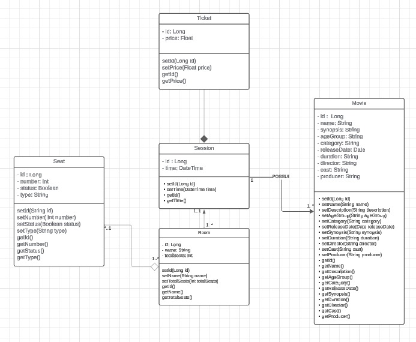

# Requirements
- Docker
- Docker Compose (comes with docker desktop for Windows users)
- Java 21 (For **Windows users** if your IDE doesn't manage JDK versions, maybe you will need to change manually by environment variables JAVA_HOME or Path), like the example below:
, more information: https://www.happycoders.eu/java/how-to-switch-multiple-java-versions-windows/
- Gradle (maybe your IDE has already installed it for you)

# How to run?
First, you will need to start the docker images by running **docker-compose up** at the root directory. This command will start two containers, PostgreSQL and RabbitMQ.
After that, you are good to go, just start by your IDE or run **./gradlew bootRun** at root directory.

### Common beginners errors for Windows users
If you encounter some persisting errors trying to setup properly, probably the reasons are:
- Wrong Java Version at your Path or JAVA_HOME:

- Running at wrong order. The docker image need to be run first, the spring will fail on startup if it doesn't encounter the specified database available

**To run the application using your IDE instead of the terminal, you will likely need to learn how to manage JDK versions within your IDE rather than changing environment variables**
IntelliJ example:

# Class diagram

