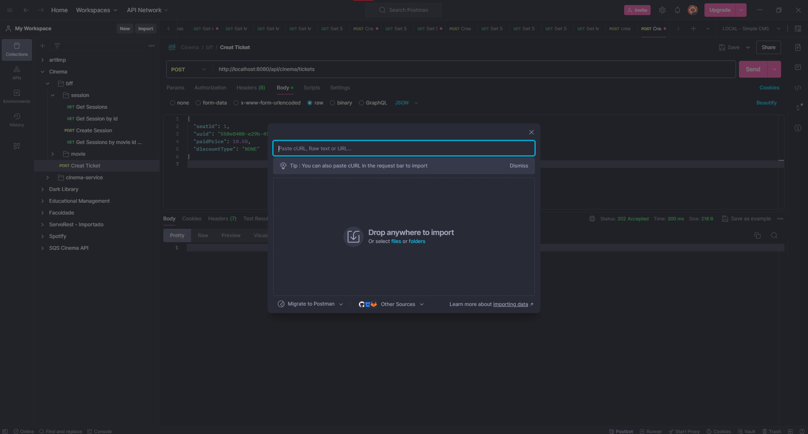
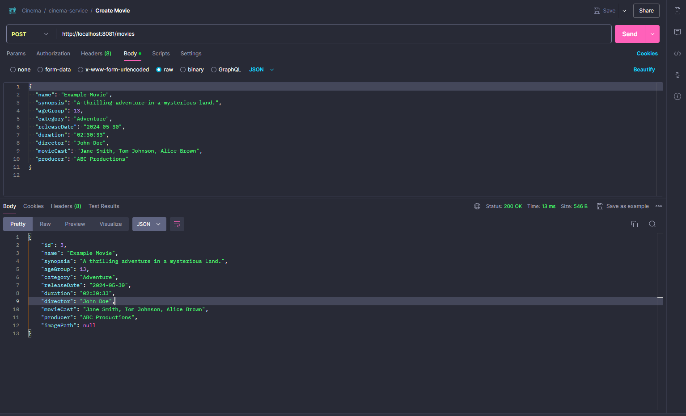
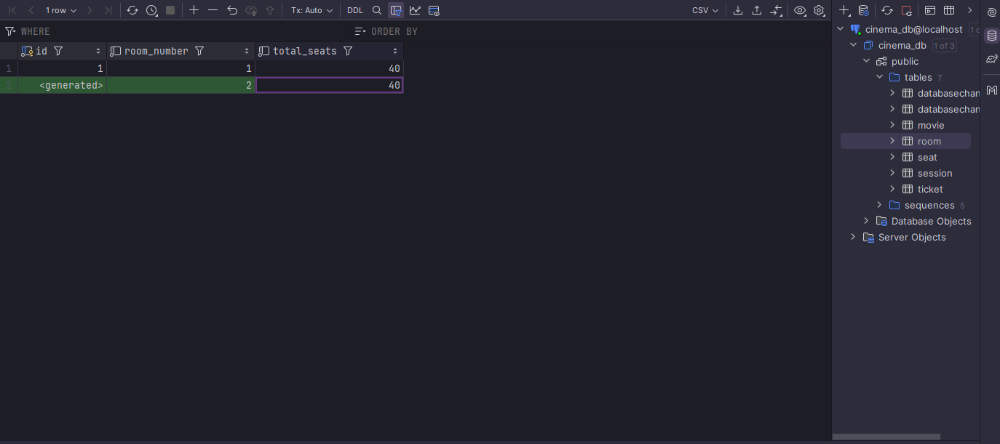
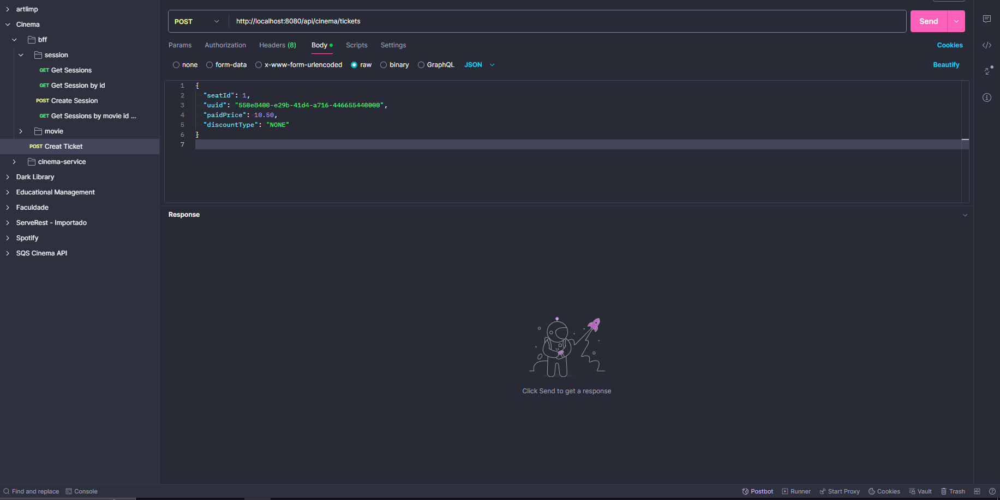
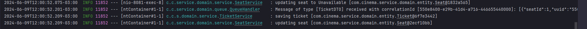

# Cineaart

## cinema-service

The cinema-service application aims to manage a cinema. After you have followed the steps in the [README.md](README.md), we are going now to
actually make the application work doing the main workflow.

The endpoints for the example are in the [Postman documentation](api-doc/Cinema.postman_collection.json), you can copy and past the json in the "import" menu from Postman:

### Ticket Creation Workflow

Obs: I used the cinema-service endpoints to be more simple and clear, but the idea is to use the bff endpoints, not calling directly the cinema-service.

1. For the ticket creation workflow, first, we need to create a Movie:

2. Now, we need to create a room. For now, we create the room manually in the database. I use the Intellij interface for that, but you can use a free tool like DBeaver.

3. So now, we are going to create a session by passing the movie ID and room ID through the path variable

4. And now for last but not least, we are going to create the ticket. Note that in this case, even for the example, we need to create it through the cineaart-bff service, since it is done via messaging.

5. The API will return 202 Accepted, and we can see the logs in the cinema-service. Should be something like that:

